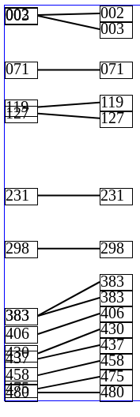

# unclutter1d

Small utility to "unclutter" items (or segments) in a one-dimensional domain.

Given N segments of the form [start,length] where start and end are floating-point
numbers, this calculates a second set of segments (each of the same length), but
offset in such a way that:
- no segments overlap (for every pair of segments S1, S2, S1's start is not between
  S2's start and start+length, and S1's start+length is not between S2's start and
  start+length)
- The total offset (sum of the delta of the start value for every segment) is
  minimized via a naïve algorithm.

## Motivation

The main use case for `unclutter1d` is displaying labels in a one-dimensional axis,
in such a way that the labels don't overlap even if the data points they refer to overlap.

In the following screenshot, there are arbitrary data points at the left column, with a label
showing each value. Note how some labels with close data points overlap. At the right,
the same labels but after the `unclutter1d` algorithm has been applied.



Please note that for `unclutter1d` to work properly, the size (height) of the labels
must be known in advance.

## Usage

Install from `npm` through the usual `npm install unclutter1d` or `yarn unclutter1d`, or fetch from your favourite NPM CDN.

The input must be an array of two-item arrays of the form [start, length], e.g.:

```
import unclutter1d from 'unclutter1d';

let segments = [[0,2], [1,2], [5,2]];
let uncluttered = unclutter1d(segments);
```

In the above example, the vertical offset of each label is the start, and the height
of each label is the length. Even though the example uses the same length for all labels,
the algorithm also works with dissimilar lengths.

Optionally, specify a minimum and maximum values:

```
let min = 0;
let max = 10;
let uncluttered = unclutter1d(segments, min, max);
```


